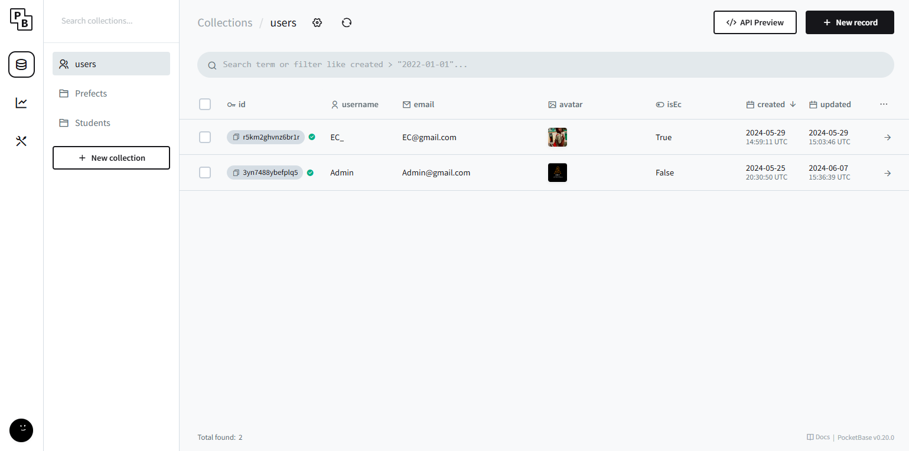
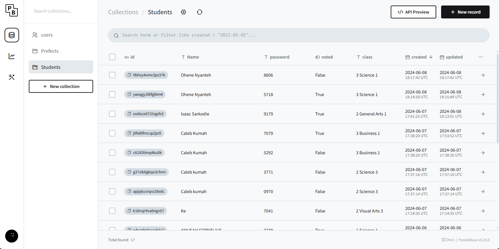
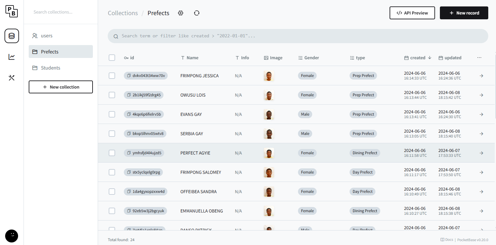

## Steps To SetUp the Backend and Database
# Setting Up PocketBase in a `backend` Folder

## Step 1: Create Directory for the Backend


1. Download PocketBase

2. Initialize PocketBase
    ```./pocketbase serve```

4. Access PocketBase Admin UI
5. Create Admin Account
6. Log in to the PocketBase Admin UI.
7. Create 2 new collections in Addition to the old "Users" collection. Prefects and Students  
8. In Students Add these fields with the same spelling and order: Name, password, voted, class 
9. In Prefects Add these fields with the same spelling and order: Name, info, Image, number_of_votes, Gender, type
10. enable All the Api Rules and run frontend